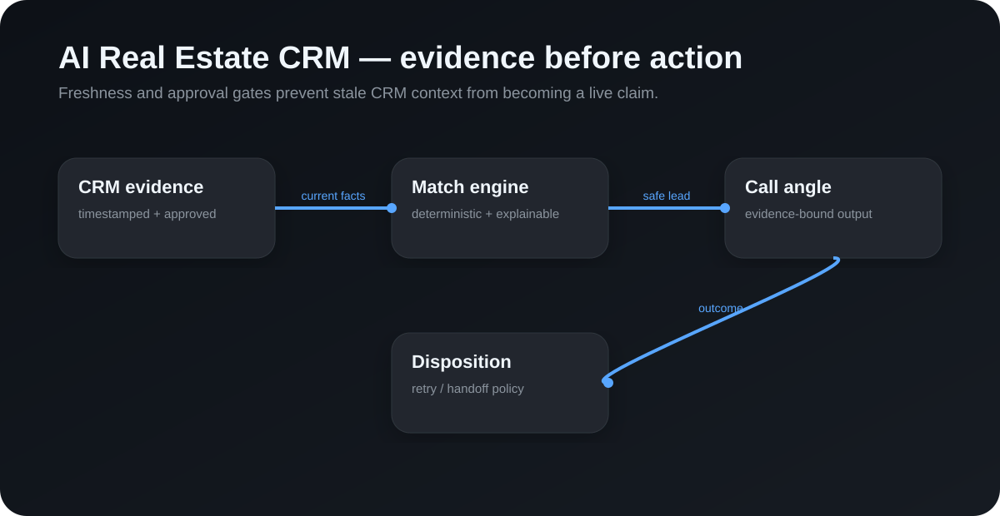

# AI Real Estate CRM

A synthetic-first reference implementation for building an AI-assisted real-estate CRM without letting historical data or a language model invent current commercial facts.

The core idea is simple: current evidence is a first-class object. Matching, call angles and follow-up decisions only proceed when required facts are approved and inside explicit freshness windows.

## Included

- Evidence objects with approval and observed timestamps
- Deterministic buyer-to-listing matching
- Hard blockers for stale price, availability and requirements
- Evidence-bound call-angle generation
- Call disposition and retry policy
- Synthetic CLI demo
- Tests for matching and safety behavior

## Run

Install dependencies, then run npm test or npm run demo.

The demo contains no real people, contact details, properties or provider credentials.

## Design principles

1. Current facts beat historical CRM assumptions.
2. Matching is deterministic and explainable.
3. A blocked match cannot produce a persuasive call angle.
4. Voice-agent outcomes are explicit dispositions, not free-form guesses.
5. Do-not-contact and wrong-person outcomes suppress automated retry.
6. Provider credentials and production telephony belong outside the public core.

## Public vs private boundary

Public: evidence model, matching engine, call-angle contract, dispositions, retry policy and synthetic tests.

Private: customer records, property databases, production prompts, carrier integrations, provider credentials, operational logs and live outreach configuration.
